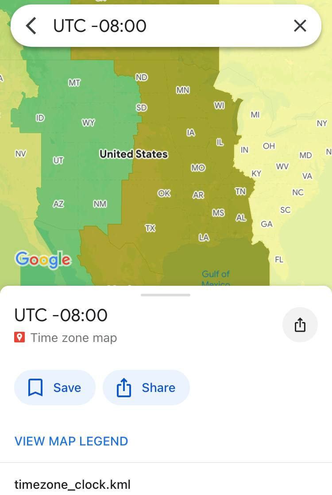
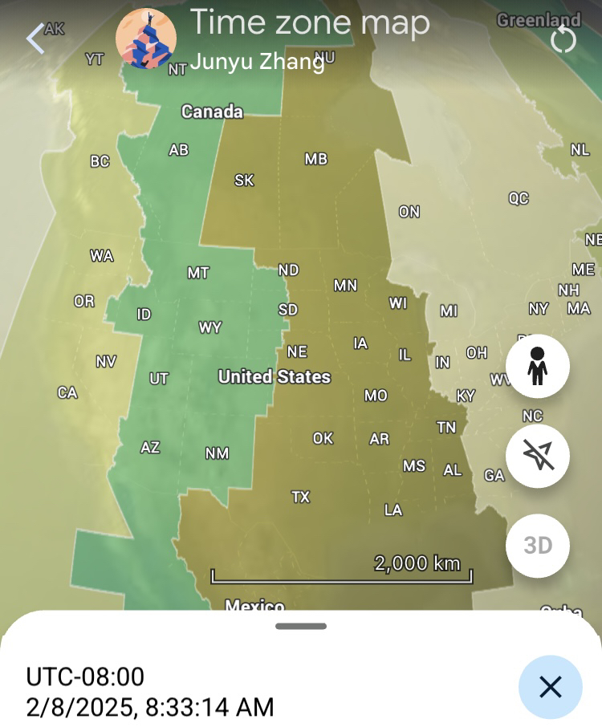
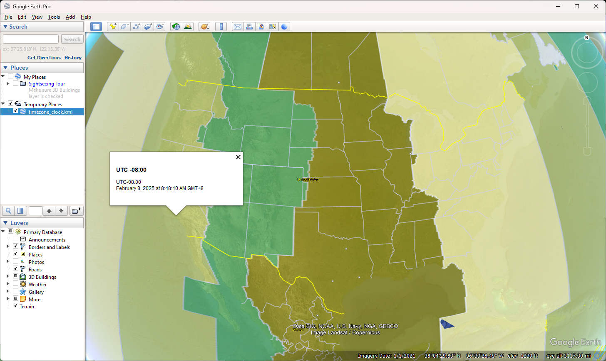

# google_earth_time_zone
Show time zone map on
1. Google Maps on web, and mobile.
2. Google Earth in web browser, mobile, and desktop, also shows time.

The project is based on this file:
http://www.barnabu.co.uk/files/kmz/timezone_clock.kmz

It's modified to be cross-platform for Google Earth by adding time zone info in content of features, rather than just in title.

## Functions
Have time zone overlay over the globe.

Click on any location on the map will show time zone info and time

## How to use
[View  on Google Maps](https://www.google.com/maps/d/u/0/viewer?mid=1p6Q6MCzlLxrtaU6A6yn4od-uj4u9R6w8&usp=sharing)  
[View on Google Earth](https://earth.google.com/earth/d/1KD_1T8DSfpZK2PK2YF3Wpc-HSIru0BHQ?usp=sharing)  

Open Google Earth in [web browser](https://earth.google.com/web/), mobile, or desktop:
https://www.google.com/earth/versions/

Import the KML file [timezone_clock.kml](../../raw/main/timezone_clock.kml) into Google Earth:
https://support.google.com/earth/answer/7365595

## Screenshots
Google Maps web (Firefox):  

Google Maps mobile (iOS):  

Google Earth web (Firefox):  

Google Earth mobile (iOS):  

Google Earth desktop (Windows):  

## Diff compared to original file
1. Made cross-platform by adding time zone info in content of features
2. Modified all GMT to UTC
3. Fix typo -03.30 to -03:30

## Misc.
There are 38 time zones in total.
