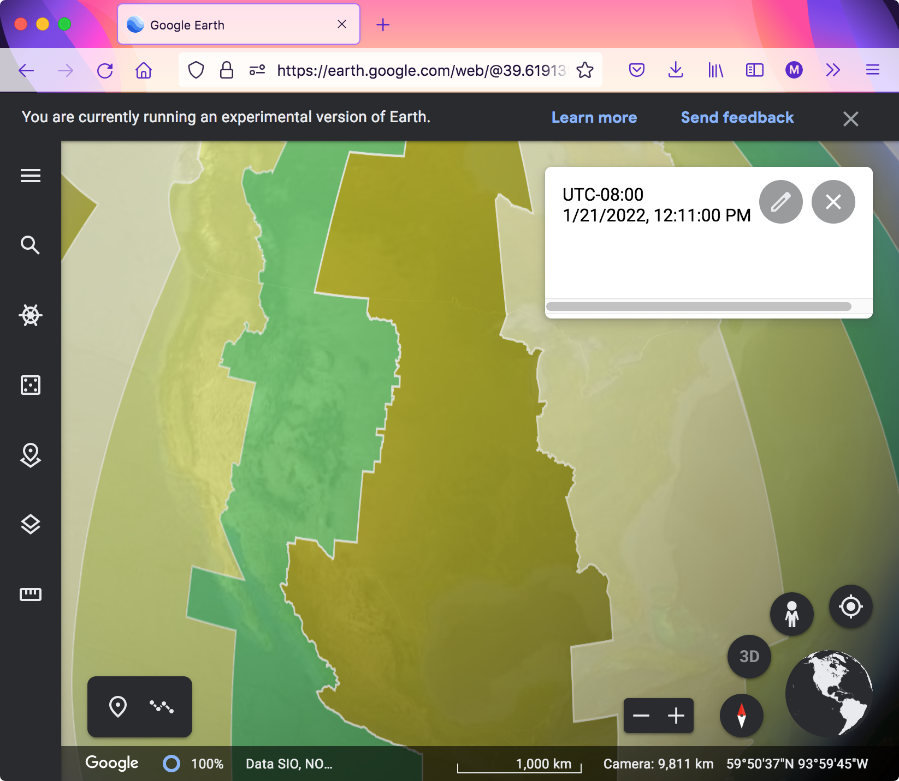
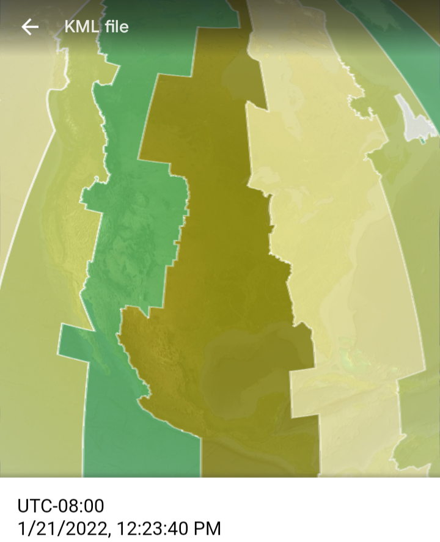
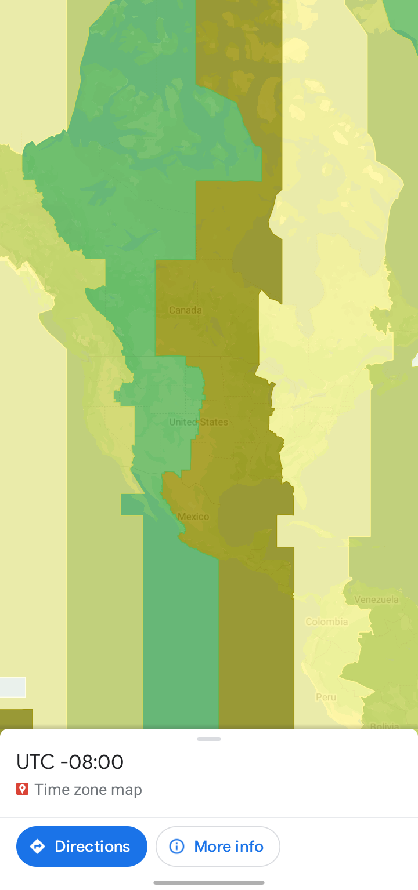

# google_earth_time_zone
Show time zone map on Google Earth in web browser, mobile, and desktop.

The project is based on this file:
http://www.barnabu.co.uk/files/kmz/timezone_clock.kmz

It's modified to be cross-platform by adding time zone info in content of features, rather than just in title.

## Functions
Have time zone overlay over the globe.

Click on any location on the map will show time zone info and time

## How to use
Open Google Earth in [web browser](https://earth.google.com/web/), mobile, or desktop:
https://www.google.com/earth/versions/

Import the KML file [timezone_clock.kml](../../raw/main/timezone_clock.kml) into Google Earth:
https://support.google.com/earth/answer/7365595

[Preview](https://www.google.com/maps/d/u/0/viewer?mid=1p6Q6MCzlLxrtaU6A6yn4od-uj4u9R6w8&usp=sharing) on Google My Maps

## Screenshots
Web (Firefox):

Mobile (Android):

Desktop (macOS):

Preview on Google My Maps on the web (Firefox):

Preview of Google My Maps on Google Maps Android:

## Diff compared to original file
1. Made cross-platform by adding time zone info in content of features
2. Modified all GMT to UTC
3. Fix typo -03.30 to -03:30

## Misc.
There are 38 time zones in total.
