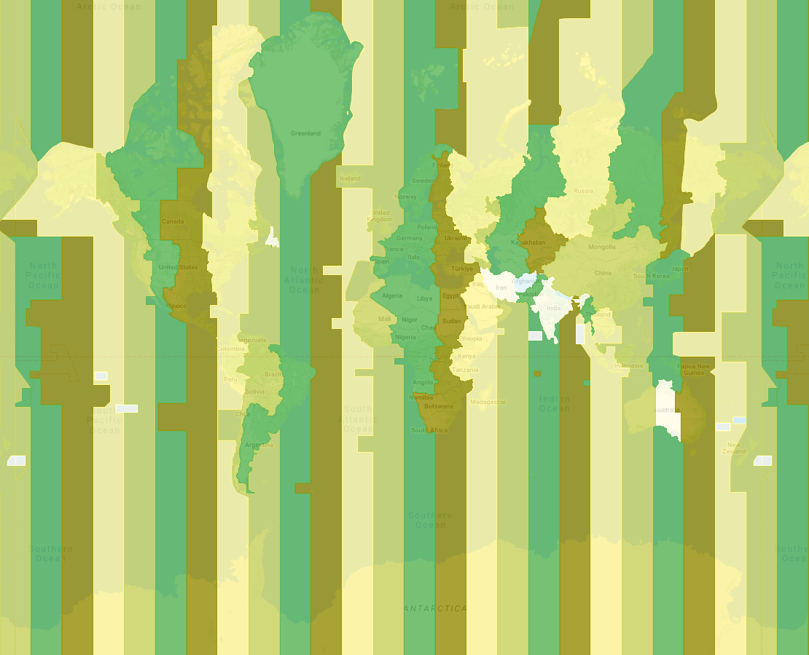
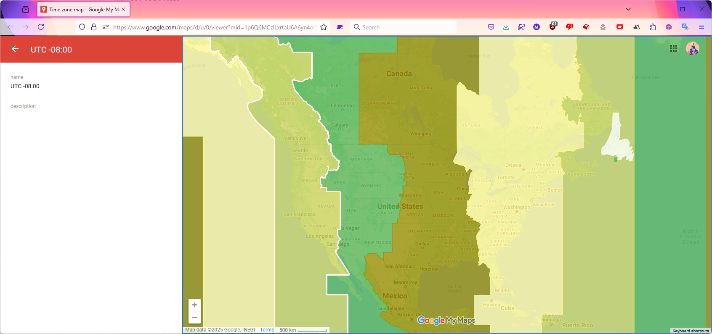
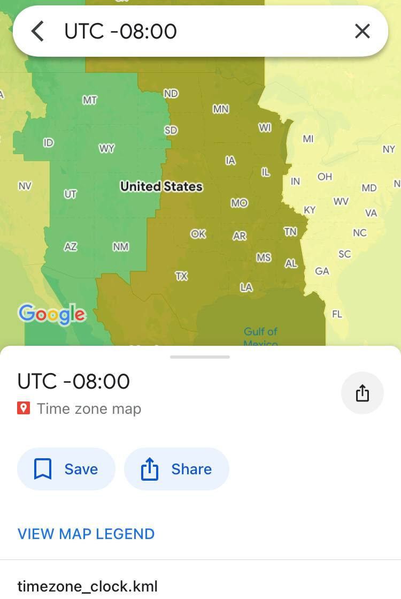
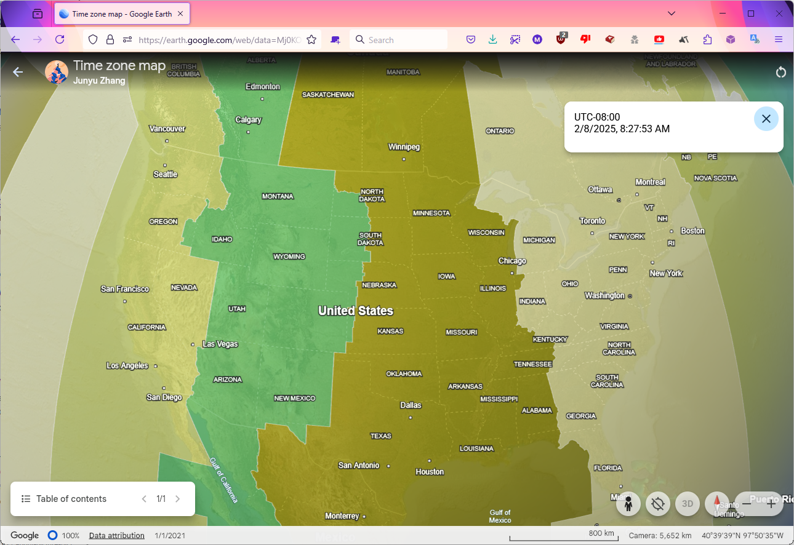
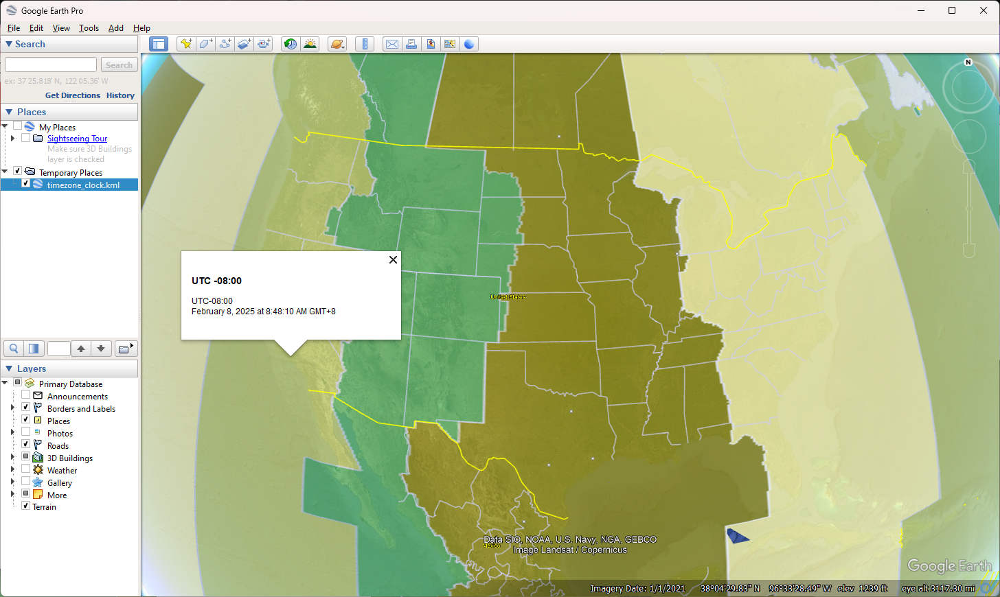

# google_earth_time_zone
Google Maps & Earth time zone map on web, mobile, desktop 

## Usage
* [View on Google Maps](https://www.google.com/maps/d/u/0/viewer?mid=1p6Q6MCzlLxrtaU6A6yn4od-uj4u9R6w8&usp=sharing) on web or mobile apps  
* [View on Google Earth](https://earth.google.com/earth/d/1KD_1T8DSfpZK2PK2YF3Wpc-HSIru0BHQ?usp=sharing) on web or mobile apps  
* Open [Google Earth desktop](https://www.google.com/earth/about/versions/#earth-pro), then [import](https://support.google.com/earth/answer/7365595) the KML file [timezone_clock.kml](../../raw/main/timezone_clock.kml)

## Features
* Has time zone overlay over the globe.  

* Click on any location on the map will show time zone info. In Google Earth, it will also show time.  

## Commits summary
1. Made the Google Earth [file](http://www.barnabu.co.uk/files/kmz/timezone_clock.kmz) compatible with Google Maps by adding time zone info in the content of features, rather than just in the title.
2. Modified all GMT to UTC
3. Fix typo -03.30 to -03:30

## Misc.
There are 38 time zones in total.

## Screenshots on all platforms
Google Maps web (Firefox):  

Google Maps mobile (iOS):  

Google Earth web (Firefox):  

Google Earth mobile (iOS):  

Google Earth desktop (Windows):  

